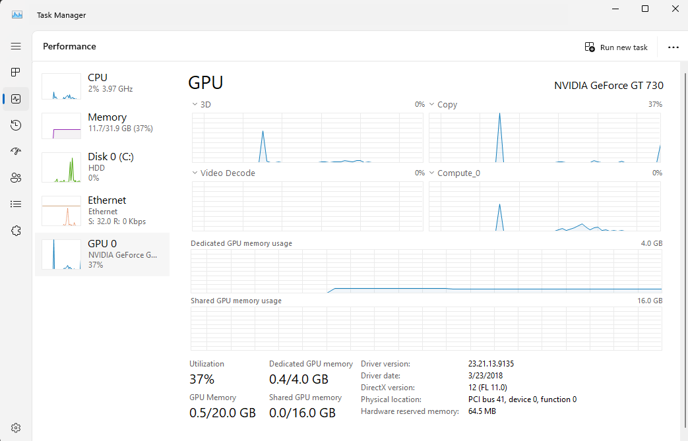

# CUDA Development
To help in understanding CUDA development for NVIDIA GT 730 (https://www.amazon.com/dp/B09KTFWNPK), and is not support under OLLAMA, though this card is supported. I choose this card for it's low profile configuration as the card will be installed in a 2U mini-itx rack case. Since OLLAMA does not support this GPU, a private build of OLLAMA must be performed to include support for this GPU card.




## Developer Environment Configuration

    1. Install GT 730 driver v391.35* from https://www.nvidia.com/Download/driverResults.aspx/132845/en-us/
    2. Install Visual Studio 2022 or latest from https://visualstudio.microsoft.com/downloads/
    3. Install latest CUDA toolkit from https://developer.nvidia.com/cuda-toolkit
    4. Install w64devkit from https://github.com/skeeto/w64devkit/releases 

*Windows 11 can install the Windows 10 NVIDIA drivers.

## Compile the GPU INFO
Open the Developer POwerdhell for Visual Studio 2022 terminal, then change to the directory and run make to build the gpu_info.exe

```
CUDA-capable device found!
Device Name: �
Compute Capability: -900109984.623
Total Global Memory: 134182587 MB
```

Now that I have a test CUDA application working (detecting the GPU) with this card, progress is being made on the OLLAMA private build.
